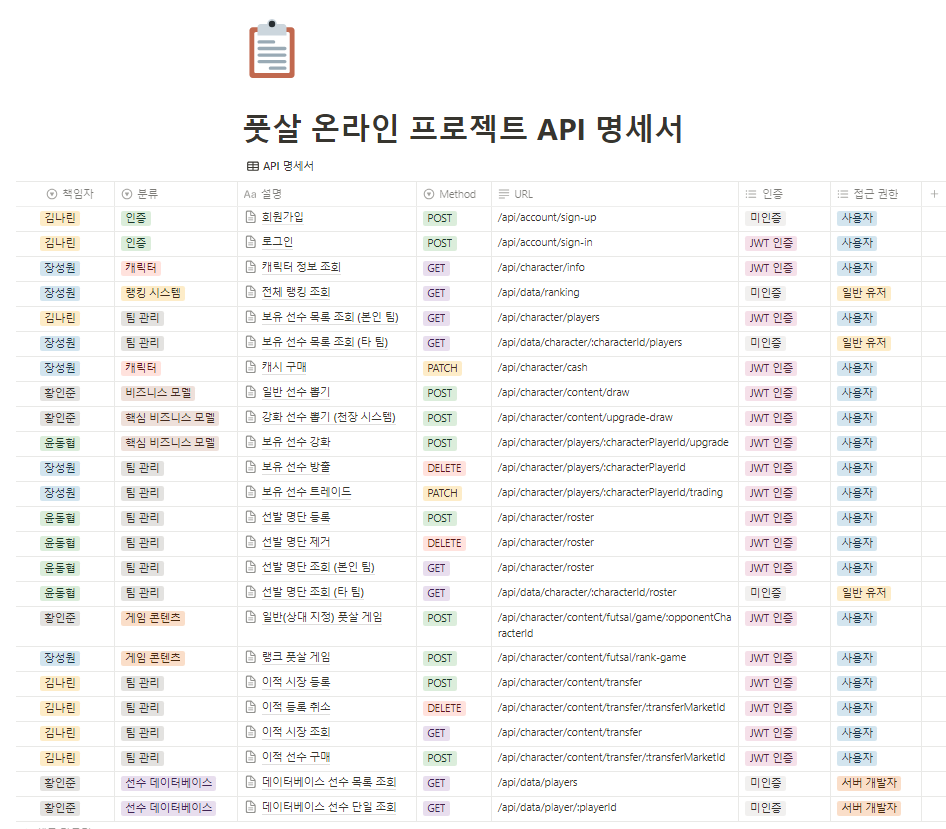
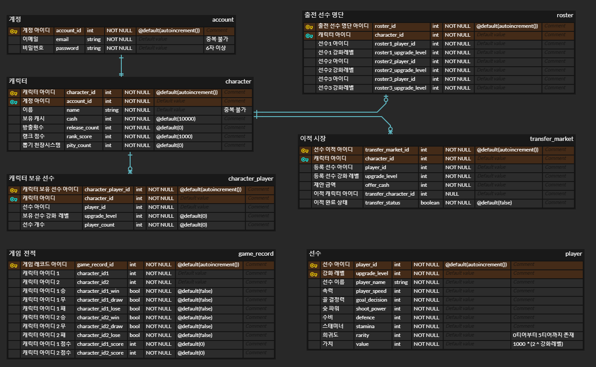
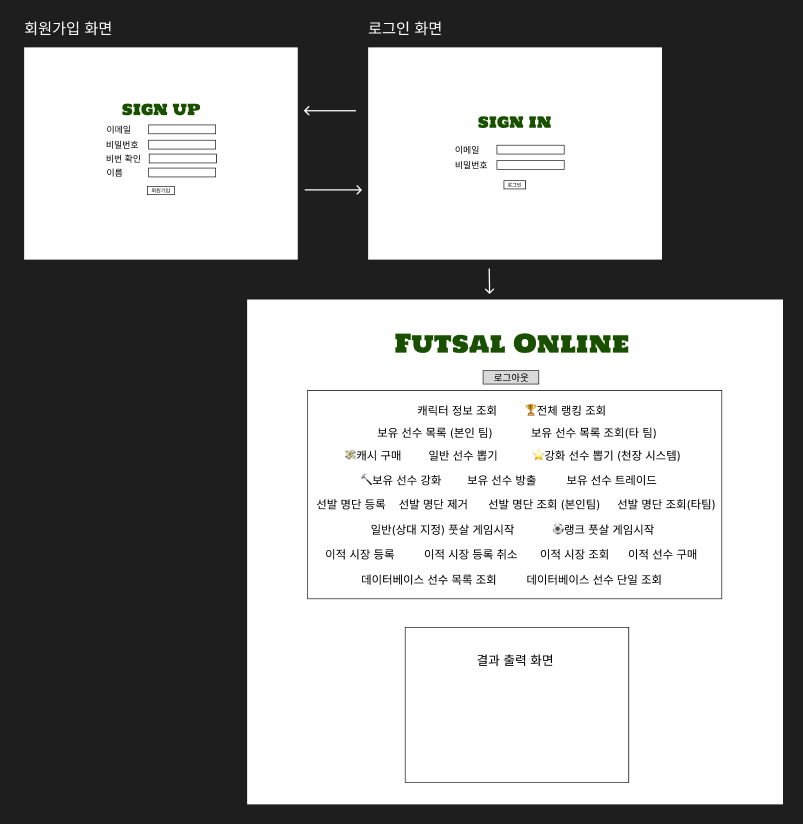
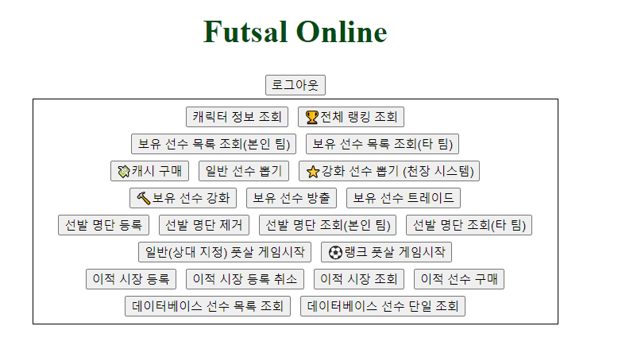
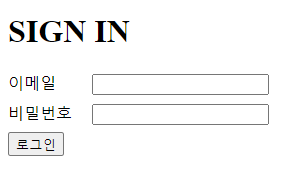

# Futsal Online Project

### 풋살 온라인 FE / BE AWS 배포

- [풋살 온라인 BackEnd 서버 링크](http://eliotjang.shop:3000)
- [풋살 온라인 FrontEnd 서버 링크](http://eliotjang.shop:5501)

### 프로젝트 설계 및 구현

- [프로젝트 회의록](https://eliotjang.notion.site/d466766b85db4ea4a22f9a56976c6515?pvs=4)

### API 명세서

- [API 명세서 링크](https://www.notion.so/eliotjang/API-60043ac2edea43e5b43105aac4f8a4f5)



### ERD 클라우드

- [ERD 클라우드 링크](https://www.erdcloud.com/d/ePThQxtKBRe8kzFfR)



### 와이어프레임

- [와이어프레임 링크](https://www.figma.com/design/UcnIVjPYfHQpahml5NBMyH/Fooball-Project-%EC%99%80%EC%9D%B4%EC%96%B4%ED%94%84%EB%A0%88%EC%9E%84?node-id=0-1&t=Rq98wdfSAZc6W5xW-0)



### 프론트엔드 구현

- 메인 화면  
  

- 로그인 화면  
  

- 예시 (랭킹 조회)  
  

### BackEnd Skills


### 폴더 구조

```markdown
.vscode/
└── settings.josn

assets/
├── html/
│├── main.html
│└── singin.html
└──
node_modules/

prisma/
└── schema.prisma

src/
├── controllers/
│ └── functions.js
├── middlewares/
│ ├── auth.middleware.js
│ └── error-handling.middleware.js
├── routes/
│ ├── account/
│ │ └── account.router.js
│ ├── character/
│ │ ├── content/
│ │ │ ├── futsal/
│ │ │ │ ├── game.router.js
│ │ │ │ └── transfer.router.js
│ │ │ ├── draw.router.js
│ │ │ └── transfer.router.js
│ │ ├── players
│ │ │ ├── player.router.js
│ │ │ ├── release.router.js
│ │ │ ├── trading.router.js
│ │ │ └── upgrade.router.js
│ │ ├── cash.router.js
│ │ ├── info.router.js
│ │ └── roster.router.js
│ ├── data/
│ │ ├── character/
│ │ │ ├── player.router.js
│ │ │ └── roster.router.js
│ │ ├── player.router.js
│ │ └── ranking-system.router.js
├── utils/
│ ├── prisma/
│ │ └── index.js
│ ├── config.js
│ └── joi-schema.js
└── app.js

.env
.gitignore
.prettierrc
package.json
README.md
yarn.lock
```

### 게임 방법

- 회원가입 후 로그인을 한다.
- 선수 구성
  - 보유 선수들로 출전 선수들을 구성한다.
- 선수 구입
  - 선수들을 구입 하는 방법으로는 뽑기, 이적시장, 트레이딩이 존재한다.
- 뽑기
  - 강화 선수 뽑기는 일반 뽑기보다 비싸지만 고티어의 확률이 더 높고 강화가 된 선수들도 나올 수 있다  
    또한 뽑기 스택이 10이 쌓이면 100% 확률로 0티어 선수가 뽑힌다
- 이적시장
  - 이적 시장에 등록을 하게 되면 누군가가 해당 선수를 사기 전까지는 돈이 들어오지 않는다
  - 이적 시장에 등록한 선수가 필요하다면 이적 등록을 취소할 수도 있다
  - 이적 시장에서 마음에 드는 선수가 있다면 구매를 할 수도 있다
- 트레이딩
  - 상대 선수들 중에 마음에 드는 선수가 있다면 트레이딩을 해서 보유하고 있는 선수 혹은 선수+캐시와 교환할 수 있다
- 선수 판매
  - 선수가 마음에 들지 않거나 돈이 필요하다면, 방출을 할 수도 있고 이적이나 트레이딩을 할 수 있다
  - 단 선수 방출을 하게 되면 방출 패널티로 뽑기에 쓰이는 캐시가 증가한다
- 선수 강화
  - 선수 스탯을 높이고 싶다면 동일 선수를 사용하여 강화를 진행할 수 있다
- 풋살 게임
  - 대상을 지정하여 일반 게임을 즐기거나 랭크 점수를 기반으로 자동 매칭이 되는 랭크 게임을 즐긴다.
- 랭킹 시스템
  - 본인의 랭킹 순위가 궁금하다면 랭킹 조회를 하면 된다.
- 캐시
  - 만약 캐시가 부족하다면 캐시를 결제하면 된다
- 선수 정보 조회
  - 보유하고 있지 않은 선수들의 능력치가 궁금하다면 전체 선수 조회나 특정 선수 조회를 할 수도 있다
