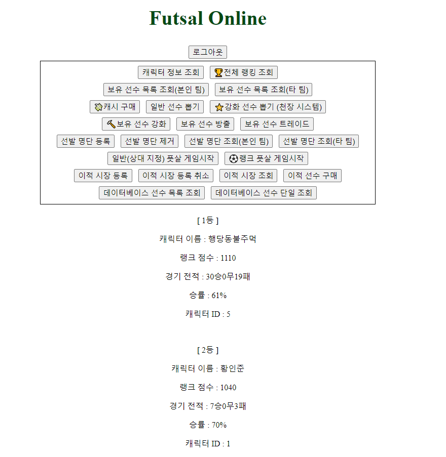

# Futsal Online Project

### 게임 방법

회원가입 후 로그인을 한다.

### 선수 구성

- 보유 선수들로 출전 선수들을 구성한다.

### 선수 구입

선수들을 구입 하는 방법으로는 뽑기, 이적시장, 트레이딩이 존재한다.

- ### 뽑기
  - 강화 선수 뽑기는 일반 뽑기보다 비싸지만 고티어의 확률이 더 높고 강화가 된 선수들도 나올 수 있다  
    또한 뽑기 스택이 10이 쌓이면 100% 확률로 0티어 선수가 뽑힌다
- ### 이적시장
  - 이적 시장에 등록을 하게 되면 누군가가 해당 선수를 사기 전까지는 돈이 들어오지 않는다
  - 이적 시장에 등록한 선수가 필요하다면 이적 등록을 취소할 수도 있다
  - 이적 시장에서 마음에 드는 선수가 있다면 구매를 할 수도 있다
- ### 트레이딩
  - 상대 선수들 중에 마음에 드는 선수가 있다면 트레이딩을 해서 보유하고 있는 선수 혹은 선수+캐시와 교환할 수 있다

### 선수 판매

- 선수가 마음에 들지 않거나 돈이 필요하다면, 방출을 할 수도 있고 이적이나 트레이딩을 할 수 있다
- 단 선수 방출을 하게 되면 방출 패널티로 뽑기에 쓰이는 캐시가 증가한다

### 선수 강화

- 선수 스탯을 높이고 싶다면 동일 선수를 사용하여 강화를 진행할 수 있다

### 풋살 게임

- 대상을 지정하여 일반 게임을 즐기거나 랭크 점수를 기반으로 자동 매칭이 되는 랭크 게임을 즐긴다.

### 랭킹 시스템

- 본인의 랭킹 순위가 궁금하다면 랭킹 조회를 하면 된다.

### 캐시

- 만약 캐시가 부족하다면 캐시를 결제하면 된다

### 선수 정보 조회

- 보유하고 있지 않은 선수들의 능력치가 궁금하다면 전체 선수 조회나 특정 선수 조회를 할 수도 있다

제일 중요한 것은 재밌게 즐기기!

### AWS 배포 링크

- [Futsal Online Project](http://eliotjang.shop:3000)

### API 명세서

- [API 명세서 링크](https://www.notion.so/eliotjang/API-60043ac2edea43e5b43105aac4f8a4f5)


### ERD 클라우드

- [ERD 클라우드 링크](https://www.erdcloud.com/d/ePThQxtKBRe8kzFfR)


### 와이어프레임

- [와이어프레임 링크](https://www.figma.com/design/UcnIVjPYfHQpahml5NBMyH/Fooball-Project-%EC%99%80%EC%9D%B4%EC%96%B4%ED%94%84%EB%A0%88%EC%9E%84?node-id=0-1&t=Rq98wdfSAZc6W5xW-0)


### 프론트엔드 구현

- 메인 화면  
  

- 로그인 화면  
  

- 예시 (랭킹 조회)  
  

### 설계 및 구현

- 필수 구현 사항

  - 회원가입
    - 계정 생성 및 캐릭터 생성
  - 로그인
    - 계정 로그인
  - 캐시 구매
    - 로그인 후 구매 가능
    - 호출 시 1000캐시 획득
  - 뽑기

    - 로그인 후 뽑기 가능
    - 선수 가치에 따라 확률이 다른 뽑기 기능
    - 뽑기 1회 당 1000캐시 소모
    - 방출 패널티에 따른 추가 금액 지불
    - 뽑기 1회 당 패널티 카운트 -1
    - 뽑기 후 보유 선수 목록에 추가
    - 뽑기 확률

      

  - 보유 선수 목록 조회
    - 본인 팀 조회
      - 로그인 후 조회 가능
    - 타 팀 조회
      - 비로그인 조회 가능
      - 파라미터로 해당 캐릭터 아이디 전달
  - 출전 선수 구성
    - 출전 선수 등록
      - 로그인 후 3명의 선수까지 등록 가능
      - 동일 선수 등록 불가능
      - 등록 시 보유 선수 목록에서 제거
    - 출전 선수 조회
      - 본인 팀 조회
        - 로그인 후 조회 가능
        - 출전 선수 정보 조회 가능
      - 타 팀 조회
        - 비로그인 조회 가능
        - 파라미터로 해당 캐릭터 아이디 전달
        - 출전 선수 정보 조회 가능
    - 출전 선수 제거
      - 로그인 시 제거 가능
      - 본인의 출전 선수만 제거 가능
      - 제거 후 보유 선수 목록에 추가
  - 일반 게임
    - 상대 캐릭터 지정하여 게임 진행 가능
    - 자신을 대전 상대로 지정 불가능
    - 출전 선수가 등록되지 않으면 진행 불가
    - 선수 스탯 정규화 후 팀 스탯을 정함
    - 총 경기 시간은 90분
    - 랜덤으로 골을 넣을 때까지 지난 시간을 결정
    - 팀 스탯을 기반으로 골을 넣을 팀을 정함
    - 골 넣을 선수를 해당 팀 내에서 랜덤으로 정함
    - 90분이 지나면 경기 결과 및 진행한 게임 로그 출력

- 도전 구현 사항

  - 랭크 게임
    - 로그인 후 게임 가능
    - 랭킹 점수를 기반으로 자신과 가까운 점수를 가진 상대와 자동 매칭 게임 진행
    - 일반 게임과 진행 방식 동일
  - 유저 랭킹 조회
    - 랭킹 점수를 기준으로 내림차순 정렬
    - 등수, 랭킹 점수, 승률, 승무패 기록 출력
  - 선수 강화

    - 로그인 후 강화 가능
    - 강화할 선수와 동일한 선수만 강화 재료로 선정 가능
    - 5강까지 강화 가능
    - 실패 시 강화 재료는 소진되고 강화 대상은 0강으로 강등
    - 강화 성공 시 모든 스텟 +3, 가치 -> 기본 가치 \* 2^강화 레벨
    - 강화 확률 선정 기준
      - 0강 + 0강 = 100%
      - 1강 + 1강 = 80%
      - 2강 + 2강 = 60%
      - 3강 + 3강 = 40%
      - 4강 + 4강 = 20%
      - 강화 대상의 강화 레벨 = 강화 재료의 강화 레벨  
        -> 고유 확률 (ex. 0강 + 0강 = 100%, 3강 + 3강 = 40%)
      - 강화 대상의 강화 레벨 < 강화 재료의 강화 레벨  
        -> 100%
      - 강화 대상의 강화 레벨 > 강화 재료의 강화 레벨  
         -> (강화 대상의 강화 레벨 - 강화 재료의 강화 레벨)의 고유 확률을 곱함  
         (ex. 2강 + 1강 = 60% _ 80% = 48%, 4강 + 1강 = 20% _ 40% = 8%)
        

  - 강화 선수 뽑기

    - 로그인 후 뽑기 가능
    - 뽑기 1회 당 5000캐시 소모
    - 방출 패널티에 따른 추가 금액 지불
    - 뽑기 1회 당 패널티 카운트 -1
    - 일반 뽑기보다 고티어 선수들 확률 증가
    - 연속 뽑기 가능
    - 강화된 선수 뽑기 가능
    - 뽑기 스택이 10이 되면 0티어 확정 등장
    - 중간에 0티어 등장 시 뽑기 스택 초기화
    - 강화 뽑기 확률

      

  - 선수 방출
    - 로그인 후 방출 가능
    - 본인이 보유한 선수만 방출 가능
    - 방출 시 패널티 카운트 +1
    - 방출 시 해당 선수 가치만큼의 캐시 획득 가능
  - 이적 시장
    - 이적 등록
      - 로그인 후 등록 가능
      - 본인이 보유한 선수만 등록 가능
      - 가격 설정 가능
      - 등록 시 보유 선수 목록에서 제거
    - 이적 조회
      - 로그인 후 조회 가능
      - 이적 가능한 시장, 이적이 완료된 시장 조회 가능
      - 등록한 사람 이름, 선수 이름, 강화 레벨, 제시 캐시 조회 가능
    - 이적 구매
      - 로그인 후 구매 가능
      - 이적 성공 시 구매자의 보유 선수 목록에 추가
      - 구매 시 제시 금액만큼 캐시 차감
      - 등록자는 제시 금액만큼 캐시 증가
      - 본인이 등록한 선수는 구매 불가능
      - 이적이 완료된 선수는 구매 불가능
    - 이적 취소
      - 로그인 후 취소 가능
      - 본인이 등록한 이적만 취소 가능
      - 취소 시 보유 선수 목록에 추가
  - 선수 트레이딩
    - 로그인 시 트레이딩 가능
    - 파라미터로 교환할 보유 선수 아이디 전달
    - req.body로 교환할 상대 아이디, 상대의 보유 선수 아이디, 추가 제시 캐시 전달
    - 선수 1대1 교환만 가능
    - 트레이드 수락
      - 교환할 선수 가치 + 추가 제시 캐시 > 상대 선수 가치
      - 수락 시 상대 선수를 본인 보유 목록에 추가, 본인 선수를 상대 보유 목록에 추가
      - 수락 시 본인 캐시에서 추가 제시 캐시만큼 차감, 상대 캐시에서 추가 제시 캐시만큼 증가
    - 트레이드 거절
      - 교환할 선수 가치 + 추가 제시 캐시 < 상대 선수 가치
  - 데이터베이스 선수 조회
    - 비로그인 조회 가능
    - 전체 조회
      - 강화 레벨이 0인 선수들만 조회
      - 선수 ID 오름차순 정렬
    - 단일 조회
      - 파라미터로 선수 ID 전달
      - req.body로 강화 레벨 전달
      - 해당 강화 레벨의 특정 선수 조회

### BackEnd Skills


### 폴더 구조

```markdown
.vscode/
└── settings.josn

assets/
├── html/
│├── main.html
│└── singin.html
└──
node_modules/

prisma/
└── schema.prisma

src/
├── controllers/
│ └── functions.js
├── middlewares/
│ ├── auth.middleware.js
│ └── error-handling.middleware.js
├── routes/
│ ├── account/
│ │ └── account.router.js
│ ├── character/
│ │ ├── content/
│ │ │ ├── futsal/
│ │ │ │ ├── game.router.js
│ │ │ │ └── transfer.router.js
│ │ │ ├── draw.router.js
│ │ │ └── transfer.router.js
│ │ ├── players
│ │ │ ├── player.router.js
│ │ │ ├── release.router.js
│ │ │ ├── trading.router.js
│ │ │ └── upgrade.router.js
│ │ ├── cash.router.js
│ │ ├── info.router.js
│ │ └── roster.router.js
│ ├── data/
│ │ ├── character/
│ │ │ ├── player.router.js
│ │ │ └── roster.router.js
│ │ ├── player.router.js
│ │ └── ranking-system.router.js
├── utils/
│ ├── prisma/
│ │ └── index.js
│ ├── config.js
│ └── joi-schema.js
└── app.js

.env
.gitignore
.prettierrc
package.json
README.md
yarn.lock
```
